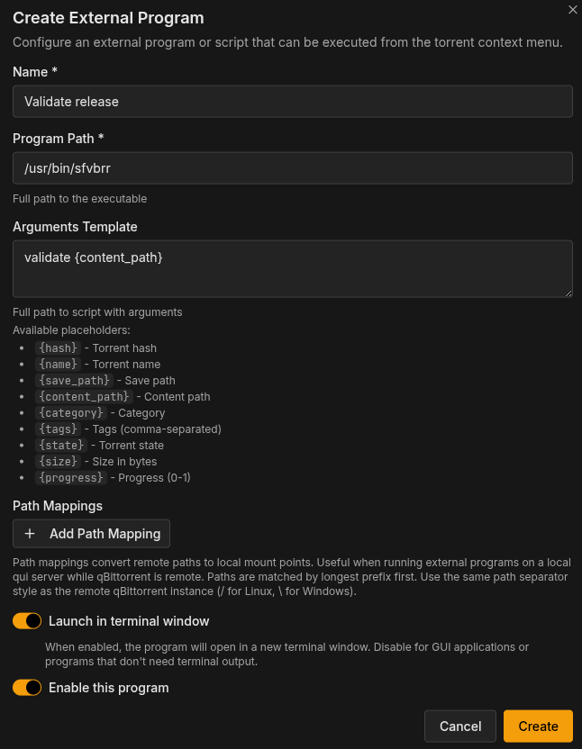

<h1 align="center">sfvbrr</h1>
<p align="center">
  <br>
  <strong>Scene. Smart. Fast.</strong><br>
  sfvbrr is a Golang tool to validate scene releases.
</p>
<div align="center">
  <p align="center">
    
    
    
  </p>

[](https://discord.gg/WehFCZxq5B)
</div>

## Table of Contents

- [Overview](#overview)
- [Quick Start](#quick-start)
- [Installation](#installation)
- [Usage](#usage)
- [Integration](#integration-with-qui)
- [Testing](#testing)
- [License](#license)

## Overview

[Releases](https://github.com/autobrr/sfvbrr/releases)

**sfvbrr** (pronounced _"es-ef-wee-brrrrrr"_) is a simple yet powerful tool for:

- Verifies your scene releases for consistency and cleanliness
- Validate checksums of scene release files (`*.sfv`) and `*.zip` file(s) integrity
- Fully customizable via YAML presets file

**Key Features:**

- **Fast**: Blazingly fast checksum and zip verification
- **Simple**: Easy to use CLI (sample outputs [below](#command-line-arguments))
- **Portable**: Single Go binary with no dependencies
- **Smart**: Detects missing/extra files based on the content and type of release
- **Customizable**: Various options in the [config](#key-concepts-of-the-presetsyaml) can change the behavior

## Quick Start

Upon the first validation run (`sfvbrr validate /path/to/folder`), the binary will automatically create a default [configuration](internal/preset/presets.yaml) in your `$HOME/.config/sfvbrr/` folder, such as:

<details>

```yaml
---
schema_version: 1
rules:
  app:
    deny_unexpected: true
    rules:
      - pattern: "*.nfo"
        min: 1
        max: 1
        description: "Requires only one .nfo file"
      - pattern: "file_id.diz"
        min: 1
        max: 1
        description: "Requires exactly one file_id.diz file"
      - pattern: "*.diz"
        max: 1
        description: "Requires no other .diz files besides file_id.diz"
      - pattern: "*.zip"
        min: 1
        description: "Requires at least one .zip file"
  audiobook:
    deny_unexpected: true
    rules:
      - pattern: "*.m3u"
        min: 1
        description: "Requires at least one .m3u file"
      - pattern: "*.sfv"
        min: 1
        description: "Requires at least one .sfv file"
      - pattern: "*.nfo"
        min: 1
        max: 1
        description: "Requires only one .nfo file"
      - pattern: "*.mp3"
        min: 1
        description: "Requires at least one .mp3 file"
  book:
    deny_unexpected: true
    rules:
      - pattern: "*.nfo"
        min: 1
        max: 1
        description: "Requires only one .nfo file"
      - pattern: "file_id.diz"
        min: 1
        max: 1
        description: "Requires exactly one file_id.diz file"
      - pattern: "*.diz"
        max: 1
        description: "Requires no other .diz files besides file_id.diz"
      - pattern: "*.zip"
        min: 1
        description: "Requires at least one .zip file"
  comic:
    deny_unexpected: true
    rules:
      - pattern: "*.nfo"
        min: 1
        max: 1
        description: "Requires only one .nfo file"
      - pattern: "file_id.diz"
        min: 1
        max: 1
        description: "Requires exactly one file_id.diz file"
      - pattern: "*.diz"
        max: 1
        description: "Requires no other .diz files besides file_id.diz"
      - pattern: "*.zip"
        min: 1
        description: "Requires at least one .zip file"
  education:
    deny_unexpected: true
    rules:
      - pattern: "*.rar"
        min: 1
        max: 1
        description: "Requires only one .rar file"
      - pattern: "*.sfv"
        min: 1
        max: 1
        description: "Requires only one .sfv file"
      - pattern: "*.nfo"
        min: 1
        max: 1
        description: "Requires only one .nfo file"
      - pattern: ".*\\.r\\d{2}$"
        regex: true
        min: 1
        description: "It usually contains one or more .r?? files"
  episode:
    deny_unexpected: true
    rules:
      - pattern: "*.rar"
        min: 1
        max: 1
        description: "Requires only one .rar file"
      - pattern: "*.sfv"
        min: 1
        max: 1
        description: "Requires only one .sfv file"
      - pattern: "*.nfo"
        min: 1
        max: 1
        description: "Requires only one .nfo file"
      - pattern: "Sample"
        type: dir
        min: 1
        max: 1
        description: "Requires only one Sample folder"
      # Syntax {mkv,mp4} handles the "OR" logic for extensions
      - pattern: "Sample/*.{mkv,mp4}"
        min: 1
        max: 1
        description: "Requires only one *.{mkv,mp4} file inside the Sample folder"
      - pattern: ".*\\.r\\d{2}$"
        regex: true
        min: 1
        description: "Requires at least one .r?? file"
  game:
    deny_unexpected: true
    rules:
      - pattern: "*.rar"
        min: 1
        max: 1
        description: "Requires only one .rar file"
      - pattern: "*.sfv"
        min: 1
        max: 1
        description: "Requires only one .sfv file"
      - pattern: "*.nfo"
        min: 1
        max: 1
        description: "Requires only one .nfo file"
      - pattern: ".*\\.r\\d{2}$"
        regex: true
        min: 1
        description: "Requires at least one .r?? file"
  magazine:
    deny_unexpected: true
    rules:
      - pattern: "*.nfo"
        min: 1
        max: 1
        description: "Requires only one .nfo file"
      - pattern: "file_id.diz"
        min: 1
        max: 1
        description: "Requires exactly one file_id.diz file"
      - pattern: "*.diz"
        max: 1
        description: "Requires no other .diz files besides file_id.diz"
      - pattern: "*.zip"
        min: 1
        description: "Requires at least one .zip file"
  movie:
    deny_unexpected: true
    rules:
      - pattern: "*.rar"
        min: 1
        max: 1
        description: "Requires only one .rar file"
      - pattern: "*.sfv"
        min: 1
        max: 1
        description: "Requires only one .sfv file"
      - pattern: "*.nfo"
        min: 1
        max: 1
        description: "Requires only one .nfo file"
      - pattern: "Sample"
        type: dir
        min: 1
        max: 1
        description: "Requires only one Sample folder"
      - pattern: "Sample/*.{mkv,mp4}"
        min: 1
        max: 1
        description: "Requires only one *.{mkv,mp4} file inside the Sample folder"
      - pattern: ".*\\.r\\d{2}$"
        regex: true
        min: 1
        description: "Requires at least one .r?? file"
  music:
    deny_unexpected: true
    rules:
      - pattern: "*.m3u"
        min: 1
        description: "Requires at least one .m3u file"
      - pattern: "*.sfv"
        min: 1
        description: "Requires at least one .sfv file"
      - pattern: "*.nfo"
        min: 1
        max: 1
        description: "Requires only one .nfo file"
      - pattern: "*.{mp3,flac}"
        min: 1
        description: "Requires at least one .mp3 or .flac file"
  series:
    deny_unexpected: true
    rules:
      - pattern: "*"
        type: dir
        min: 2
        description: "Requires at least two subfolders"
```

</details>

It provides the rulesets for the most common 0day scene categories - built on [autobrr/rls](https://github.com/autobrr/rls) library allowing you to confirm its checksums, validate your data and make sure there is no garbage in them. The category can be manually [-- overwritten](#command-line-arguments), if required.

With little to no time, you can adjust these out-of-the-box scene rules for your specific use-case.

## Installation

* Linux

<details>

```
wget $(curl -s https://api.github.com/repos/autobrr/sfvbrr/releases/latest | grep browser_download_url | grep linux_x86_64 | cut -d\" -f4)
tar xvzf sfvbrr_*
sudo mv sfvbrr /usr/local/bin/
```

</details>

* Windows

<details>

```
wget $(curl -s https://api.github.com/repos/autobrr/sfvbrr/releases/latest | grep browser_download_url | grep _windows_x86_64 | cut -d\" -f4)
unzip sfvbrr_*
move sfvbrr %windir%/system32
```

</details>

* MacOSX

<details>

```
wget $(curl -s https://api.github.com/repos/autobrr/sfvbrr/releases/latest | grep browser_download_url | grep darwin_x86_64 | cut -d\" -f4)
tar xvzf sfvbrr_*
sudo mv sfvbrr /usr/local/bin/
```

</details>

## Usage

### Key concepts of the `presets.yaml`

The `presets.yaml` file is the configuration file that defines validation rules for different scene release categories (it can be customized for any content validation, including P2P folders). It allows you to specify what files and directories are required, allowed, or forbidden for each category of release. **Rules** are individual validation checks that are applied to a folder. Each rule specifies:
- A pattern to match files or directories
- Minimum and/or maximum count requirements
- Optional description for explanation/documentation

The `pattern` field specifies what files or directories to match. It supports 3 matching modes:
- [Glob patterns](#glob-patterns) (default): Standard file glob patterns
- [Regex patterns](#regex-patterns), when `regex: true` is set: The pattern is treated as a regular expression
- [Nested patterns](#nested-patterns): Patterns with `/` to match files inside directories

The `deny_unexpected` option is a **required** boolean flag (bu default `true`) for each pattern that controls strictness - only files/directories that match at least one rule pattern are allowed. Any file or directory that doesn't match any rule will cause validation to fail.

Minimum/Maximum is another **required** field for each pattern (it has no default - `0`). If specified, the count of matching files/directories must be **greater than or equal** (min) / **less than or equal** (max) to this value.

Type is an optional parameter. It specifies whether the pattern matches `file`s or `dir`ectories. When `type: dir` is used, the pattern matches directory names, not file names.

### Matching details

#### Glob patterns

<details>

Glob patterns use standard file matching syntax:
- `*` - matches any sequence of characters (except path separators)
- `?` - matches any single character
- `[abc]` - matches any character in the set
- `*.ext` - matches all files with extension `.ext`

</details>

#### Brace expansion

<details>

You can use brace expansion for "OR" logic:
- `*.{mkv,mp4}` - matches files ending in `.mkv` OR `.mp4`
- `*.{zip,rar}` - matches files ending in `.zip` OR `.rar`

</details>

#### Regex patterns

<details>

When `regex: true`, the pattern uses Go's `regexp` package syntax:
- `.*` - matches any sequence of characters
- `\d` - matches a digit
- `\d{2}` - matches exactly two digits
- `^` - start of string
- `$` - end of string

**Example**: `.*\.r\d{2}$` matches filenames ending with `.r` followed by exactly two digits (this matches files like `file.r00`, `file.r01`, `file.r99`, etc.).

</details>

#### Nested Patterns

<details>

Patterns can include a path separator `/` to match files inside directories:
- `Sample/*.{mkv,mp4}` - matches `.mkv` or `.mp4` files inside a `Sample` directory (such as `Sample/sample.mkv`)

</details>

#### Defaults

| Property          | Default Value | Notes                               |
|-------------------|---------------|-------------------------------------|
| `type`            | `file`        | Matches files by default            |
| `regex`           | `false`       | Uses glob patterns by default       |
| `min`             | `0`           | No minimum requirement              |
| `max`             | `0`           | No maximum limit                    |
| `description`     | `""`          | Optional, for documentation only    |
| `deny_unexpected` | **Required**  | Must be explicitly set (no default) |

### Examples

<details>

#### Example 1: Simple File Requirement

```yaml
rules:
  app:
    deny_unexpected: true
    rules:
      - pattern: "*.nfo"
        min: 1
        max: 1
        description: "Requires exactly one .nfo file"
```

This rule requires exactly one `.nfo` file in the folder of an "app" type.

</details>

<details>

#### Example 2: Multiple File Types (OR Logic)

```yaml
rules:
  music:
    deny_unexpected: true
    rules:
      - pattern: "*.{mp3,flac}"
        min: 1
        description: "Requires at least one .mp3 or .flac file"
```

This rule requires at least one file that is either `.mp3` OR `.flac`.

</details>

<details>

#### Example 3: Regex Pattern

```yaml
rules:
  game:
    deny_unexpected: true
    rules:
      - pattern: ".*\\.r\\d{2}$"
        regex: true
        min: 1
        description: "Requires at least one .r?? file"
```

This rule requires at least one file matching the pattern `.r00`, `.r01`, `.r02`, etc.

</details>

<details>

#### Example 4: Directory Matching

```yaml
rules:
  episode:
    deny_unexpected: true
    rules:
      - pattern: "Sample"
        type: dir
        min: 1
        max: 1
        description: "Requires exactly one Sample folder"
      - pattern: "Sample/*.{mkv,mp4}"
        min: 1
        max: 1
        description: "Requires exactly one video file in Sample folder"
```

This example shows:
1. First rule: Requires exactly one directory named `Sample`
2. Second rule: Requires exactly one `.mkv` or `.mp4` file inside that `Sample` directory

</details>

<details>

#### Example 5: Complex Category

```yaml
rules:
  app:
    deny_unexpected: true
    rules:
      - pattern: "*.nfo"
        min: 1
        max: 1
        description: "Requires only one .nfo file"
      - pattern: "file_id.diz"
        min: 1
        max: 1
        description: "Requires exactly one file_id.diz file"
      - pattern: "*.diz"
        max: 1
        description: "Requires no other .diz files besides file_id.diz"
      - pattern: "*.zip"
        min: 1
        description: "Requires at least one .zip file"
```

This example shows multiple rules working together:
- Exactly one `.nfo` file
- Exactly one `file_id.diz` file
- No other `.diz` files (the `*.diz` pattern matches `file_id.diz` too, so max: 1 ensures only one total)
- At least one `.zip` file

</details>

### Tips & Tricks

1. **Always set `deny_unexpected`**: This is required and helps ensure releases don't contain unexpected/unwanted/unrelated files.
2. **Use specific patterns first**: When you have overlapping patterns (like `file_id.diz` and `*.diz`), put the more specific pattern first.
3. **Test your patterns**: Regex patterns can be tricky. Test properly!
4. **Use descriptions**: While optional, descriptions help document what each rule does and why it exists.
5. **Order matters for clarity**: While rule order doesn't affect validation logic (all rules must pass), ordering them logically helps with readability.
6. **Escape special characters in regex**: Remember to escape dots, parentheses, and other special regex characters when using `regex: true`.

### Command-line arguments

* Basic CLI

<details>

```bash
$ sfvbrr
sfvbrr is a high-performance scene release validation tool.

Usage:
  sfvbrr [command]

Available Commands:
  completion  Generate the autocompletion script for the specified shell
  help        Help about any command
  sfv         Validate SFV CRC-32 checksums
  update      Update sfvbrr
  validate    Validate scene release folders
  version     Print version information
  zip         Validate ZIP file integrity

Flags:
  -h, --help   help for sfvbrr

Use "sfvbrr [command] --help" for more information about a command.
```

</details>

* CLI Subcommand - **validate**

<details>

```bash
$ sfvbrr validate --help
Validate scene release folders against category-specific rules.

The command detects the release category from the folder name and validates
the folder contents against the rules defined in the preset configuration file.

When the recursive option (-r) is used, the command will search for valid
release folders in all subdirectories of the specified folder(s).

The --overwrite flag allows you to bypass automatic category detection and
manually specify a category for validation.

Examples:
  # Validate a single folder
  sfvbrr validate /path/to/release

  # Validate multiple folders
  sfvbrr validate /path/to/release1 /path/to/release2

  # Validate recursively
  sfvbrr validate -r /path/to/releases

  # Override category detection
  sfvbrr validate --overwrite app /path/to/release

Usage:
  sfvbrr validate [folder...] [flags]

Flags:
  -h, --help               help for validate
      --overwrite string   Override category detection with specified category (bypasses automatic detection)
  -p, --preset string      Path to preset YAML file (default: auto-detect)
  -q, --quiet              Quiet mode - only show errors
  -r, --recursive          Recursively search for release folders in subdirectories
  -v, --verbose            Show detailed validation results for each rule
```

</details>

* CLI Subcommand - **sfv**

<details>

```bash
$ sfvbrr sfv --help
Validate SFV (Simple File Verification) CRC-32 checksums for files in the specified folder(s).

The command will search for an SFV file (case insensitive) in each specified folder
and validate all files listed in the SFV file against their CRC-32 checksums.

When the recursive option (-r) is used, the command will search for SFV files in all
subdirectories of the specified folder(s).

Examples:
  # Validate a single folder
  sfvbrr sfv /path/to/release

  # Validate multiple folders
  sfvbrr sfv /path/to/release1 /path/to/release2

  # Validate recursively
  sfvbrr sfv -r /path/to/releases

Usage:
  sfvbrr sfv [folder...] [flags]

Flags:
  -b, --buffer-size int     Buffer size for file reading in bytes (0 = auto, default 64KB)
      --cpuprofile string   Write CPU profile to file
  -h, --help                help for sfv
  -q, --quiet               Quiet mode - only show errors
  -r, --recursive           Recursively search for SFV files in subdirectories
  -v, --verbose             Show detailed validation results for each file
  -w, --workers int         Number of parallel workers (0 = auto-detect)
```

</details>

* CLI Subcommand - **zip**

<details>

```bash
$ sfvbrr zip --help
Validate ZIP file integrity by testing all entries in ZIP files (equivalent to zip -T).

The command will search for ZIP files (case insensitive) in each specified folder
and validate all entries in each ZIP file by reading them and verifying their CRC-32 checksums.

When the recursive option (-r) is used, the command will search for ZIP files in all
subdirectories of the specified folder(s).

Examples:
  # Validate ZIP files in a single folder
  sfvbrr zip /path/to/release

  # Validate ZIP files in multiple folders
  sfvbrr zip /path/to/release1 /path/to/release2

  # Validate ZIP files recursively
  sfvbrr zip -r /path/to/releases

Usage:
  sfvbrr zip [folder...] [flags]

Flags:
  -b, --buffer-size int     Buffer size for file reading in bytes (0 = auto, default 64KB)
      --cpuprofile string   Write CPU profile to file
  -h, --help                help for zip
  -q, --quiet               Quiet mode - only show errors
  -r, --recursive           Recursively search for ZIP files in subdirectories
  -v, --verbose             Show detailed validation results for each entry
  -w, --workers int         Number of parallel workers (0 = auto-detect)
```

</details>

* CLI Subcommand - **completion**

<details>

```bash
$ sfvbrr completion bash --help
Generate the autocompletion script for the bash shell.

This script depends on the 'bash-completion' package.
If it is not installed already, you can install it via your OS's package manager.

To load completions in your current shell session:

	source <(sfvbrr completion bash)

To load completions for every new session, execute once:

#### Linux:

	sfvbrr completion bash > /etc/bash_completion.d/sfvbrr

#### macOS:

	sfvbrr completion bash > $(brew --prefix)/etc/bash_completion.d/sfvbrr

You will need to start a new shell for this setup to take effect.

Usage:
  sfvbrr completion bash

Flags:
  -h, --help              help for bash
      --no-descriptions   disable completion descriptions
```

</details>

## Integration with [Qui](https://github.com/autobrr/qui)

An example of the validation process:



## Testing

There is an entire dataset in [test/validate](test/validate/) which you can test the functionality against some hypothetical scenarios. The results are typically published in [test/TESTS_RUNSHEET.md](test/TESTS_RUNSHEET.md).


## License

This program is free software; you can redistribute it and/or modify it under the terms of the GNU General Public License as published by the Free Software Foundation; either version 2 of the License, or (at your option) any later version.

See [LICENSE](LICENSE) for the full license text.
